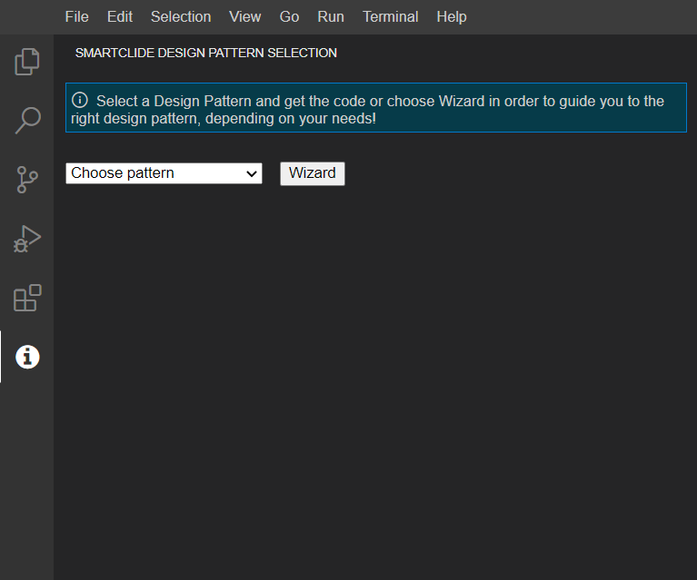
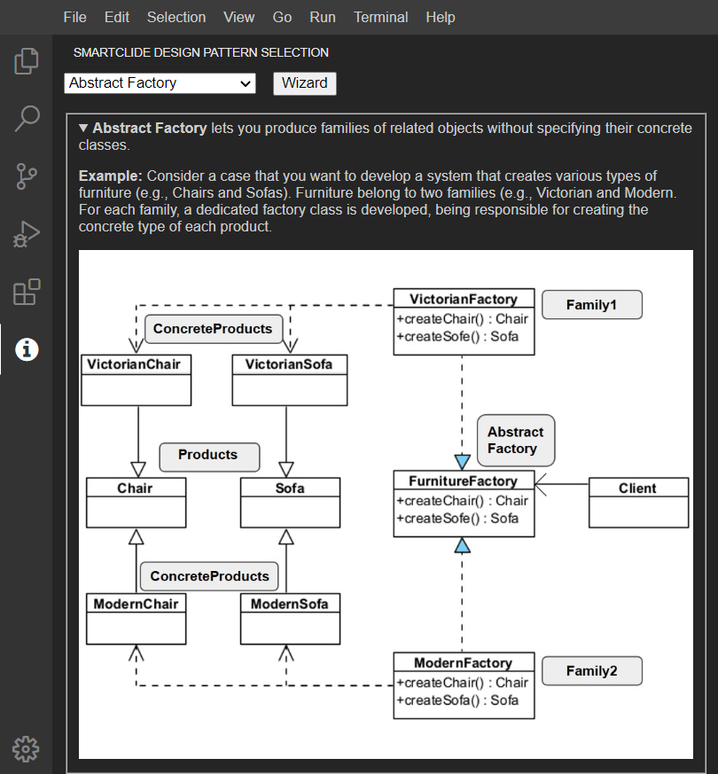
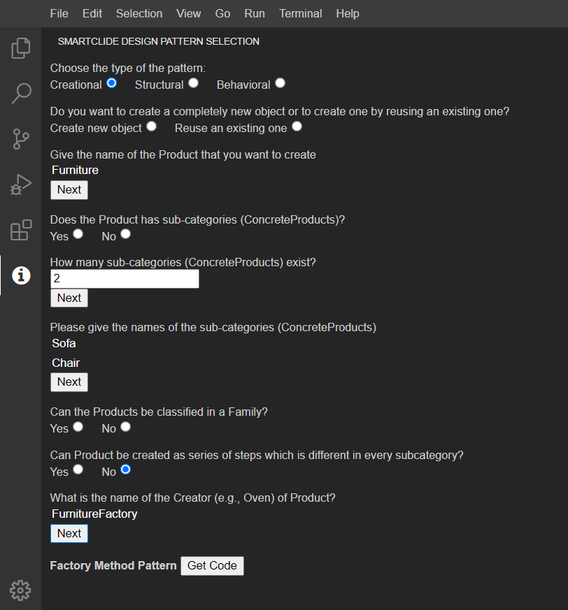
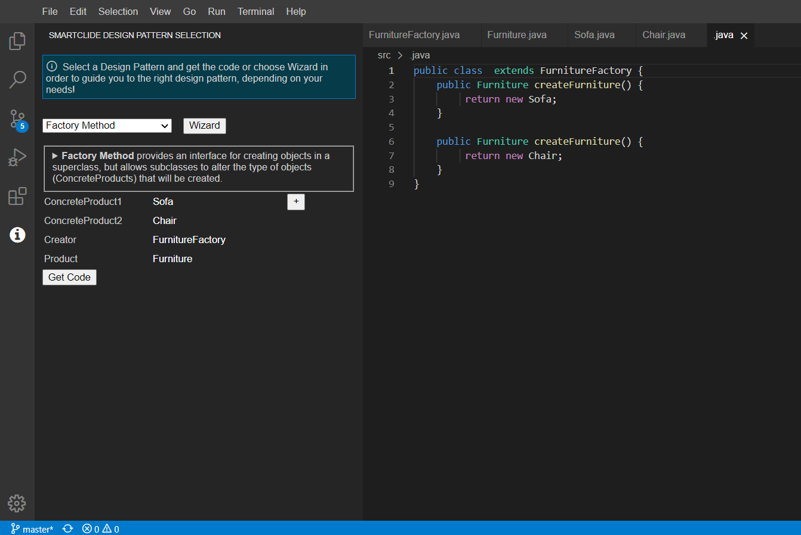
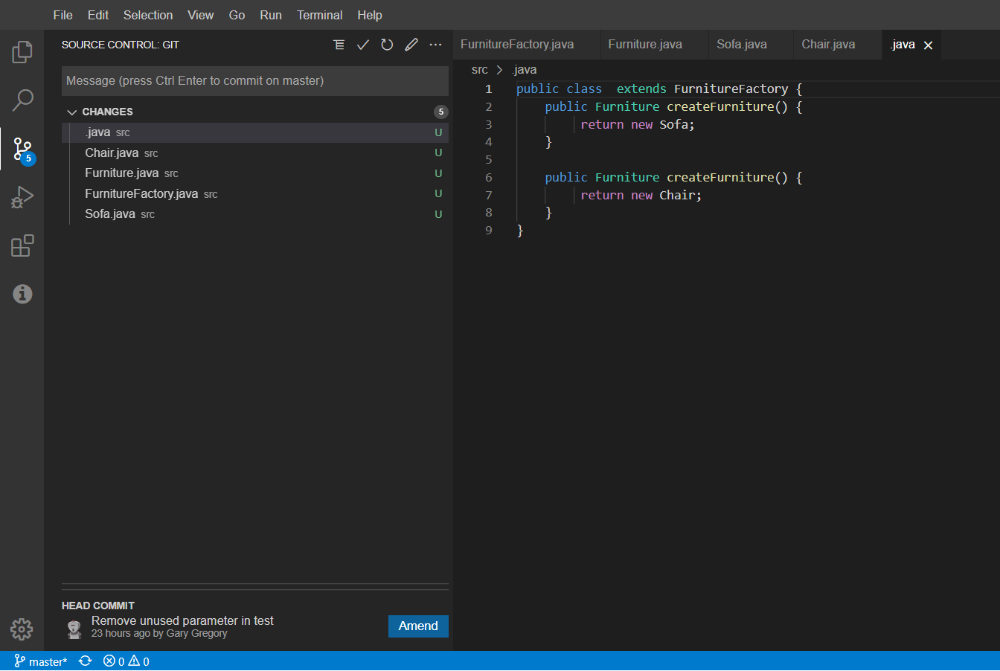

# Smartclide Design Pattern Selection
SmartCLIDE Design Pattern Selection Frontend Component

## Usage

The user can access this extention from the tab View - Smartclide Design Pattern Selection.
And the user is able to see the extension in the left side of the editor.



The user is given two options (as its visible in the previous screen): 
- select a pattern from the drop-down menu, if he/she feels confident on the pattern that will be used (EXPERT-MODE). ***By selecting from the dropdown menu.***
- use the WIZARD to start the Q&A process (WIZARD-MODE). ***By selecting the "Wizard" button.***

In the left part of the next figure, we present the main layout of option-a (EXPERT-MODE), i.e., to directly select a pattern. Having selected a GoF pattern, the user is first reminded of the aim of the pattern, and he/she is guided in the application of the pattern through a textual example and an accompanying class diagram.

In the right part of the next figure, we present the way that the Q&A process of pattern selection appears. For both cases, the roles of the pattern are mapped to either existing classes of the system, or new ones, relying on an autocomplete functionality.

|              EXPERT-MODE               |              WIZARD-MODE               |
|:-------------------------------------:|:-----------------------------------:|
|  |  |

Finally, we can see an example of generated code for the Factory Method pattern, presented in the following figures. For the case of using existing classes, the code of the pattern is appended in the end of the existing code, whereas for new classes the new files are beeing created.

|              Inputs               |              Result               |
|:-------------------------------------:|:-----------------------------------:|
|  |  |

<br/>

## Build and Run

### Preconditions to build and run

To build and run the frontend Design Pattern Selection extension of Theia, the following software is required:

- Python
- Node.js with visual studio build tools (this can be selected in the optional tools during the node.js installation or after hand in several ways, ex. with npm, or with visual studio installer)
- Yarn package manager npm install --global yarn

### How to build Design Pattern Selection Frontend

The Design Pattern Selection Frontend can be built using the following command:

```shell
yarn
```

### How to run Design Pattern Selection Frontend

After building the theia extension, you can start a local instance of theia with our extension.

#### Running the browser example

```shell
yarn start:browser
```

*or:*

```shell
yarn rebuild:browser
cd browser-app
yarn start
```

*or:* launch `Start Browser Backend` configuration from VS code.

Open http://localhost:3000 in the browser.
